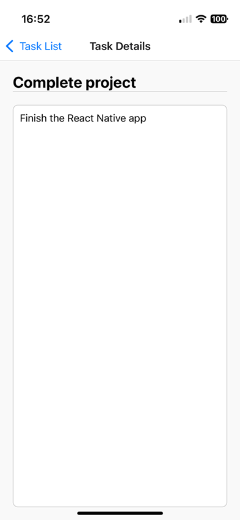

# Todo List/ Task Manager App

A React Native mobile application built with Expo and TypeScript, designed to help users manage tasks efficiently. This app focuses on clean code practices, TypeScript integration, AI-powered features, and a seamless user experience.

## Project Screen Shots



## Core Features

- **Task List Display**
  - View all tasks with titles and completion status
  - Tasks are initialized from mock data
  - Clear visual indicators for task statuses

- **Task Management**
  - Add new tasks with customizable titles and descriptions
  - Edit task details directly on the task view screen with automatic saving
  - Delete tasks easily
  - Toggle task completion with intuitive UI

- **AI-Powered Description Generation**
  - Automatically generate task descriptions using AI.
  - Integrates with Hugging Face API for text generation.

- **Navigation**
  - Detailed task view screen
  - Seamless navigation between screens

## Technical Stack

- Frameworks: React Native, Expo
- Language: TypeScript
- State Management: React Hooks (useState, useEffect)
- Navigation: React Navigation (useNavigation, useRoute) 
- AI Integration: Hugging Face Inference API
- Icons: React Native Vector Icons

## Prerequisites

Before running this application, make sure you have the following installed:

- Node.js (v12 or higher)
- npm
- React Native CLI
- Expo CLI
- Git

## Installation

1. Clone the repository:
```bash
git clone <repository-url>
```

2. Install dependencies:
```bash
npm install
```

3. Install specific dependencies for icons:
```bash
npm install react-native-vector-icons
```

4. Obtain a Hugging Face API key:
- Go to the [Hugging Face website](https://huggingface.co/).
- Create an account or log in if you already have one.
- Generate a new API token under the "Access Tokens" section.
- Copy your token and replace the placeholder in `TaskDetailsScreen.tsx`:
```bash
const HUGGING_FACE_API_KEY = 'your-api-key-here';
# Note: It is recommended to use a more secure key management method, such as a .env file, for long-term project maintenance.
```

5. Optional: 
If you want to use another GenAI model, just replace the `model` in `TaskDetailsScreen.tsx`.

## Running the App

1. Start the Expo development server:
```bash
npx expo start
```

2. Run on specific platform:
- Press `i` for iOS simulator
- Press `a` for Android emulator
- Scan QR code with Expo Go app for physical device testing

## Project Structure

- `TaskListScreen.tsx`: Main screen component that displays the list of tasks
- `TaskDetailsScreen.tsx`: Screen for viewing, editing, and generating task descriptions
- `TaskItem.tsx`: Reusable component for rendering individual task items
- `Types`: Contains TypeScript interfaces and types
- `Styles`: Contains styling information
- `MockData`: Hardcoded mock task data for development and testing
- `Utils`: Helper functions, such as a UUID generator for tasks

## Testing

1. Run the app on both iOS and Android simulators
2. Test all core functionality:
   - Adding tasks
   - Editing tasks
   - Deleting tasks
   - Toggling task status
   - Navigation between screens
3. Test AI-powered description generation:
   - Ensure the Hugging Face API key is configured in the code.
   - Generate descriptions for tasks.

## Future Enhancements

1. Integrate persistent storage for tasks
2. Support sorting and filtering tasks
3. Enable task search functionality
4. Multi-language support
5. Extend AI capabilities, such as task prioritization and tagging

## Contributing

1. Fork the repository
2. Create a feature branch (`git checkout -b feature/NewFeature`)
3. Commit changes (`git commit -m 'Add NewFeature'`)
4. Push to branch (`git push origin feature/NewFeature`)
5. Open a Pull Request

## License

This project is licensed under the MIT License
